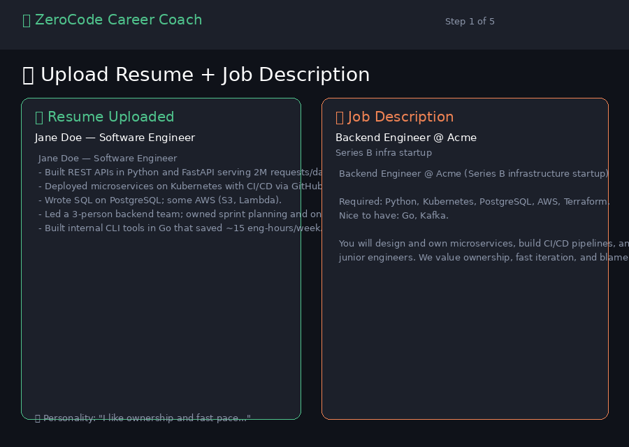
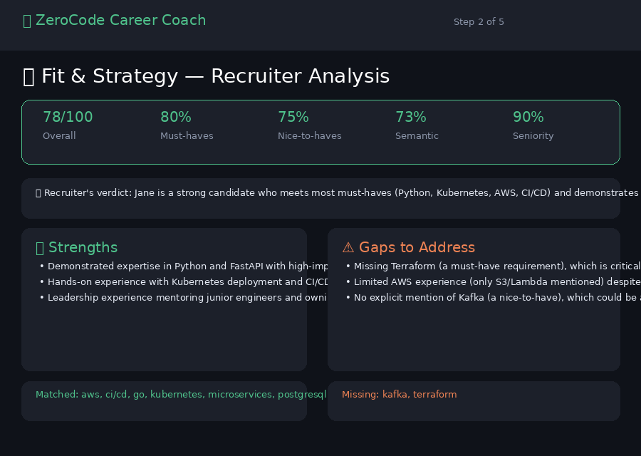
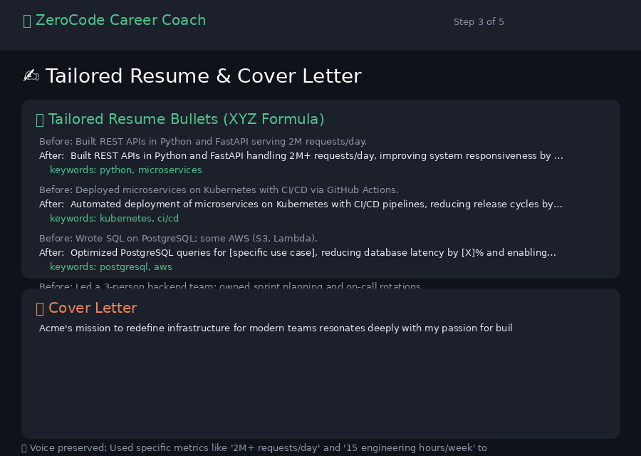
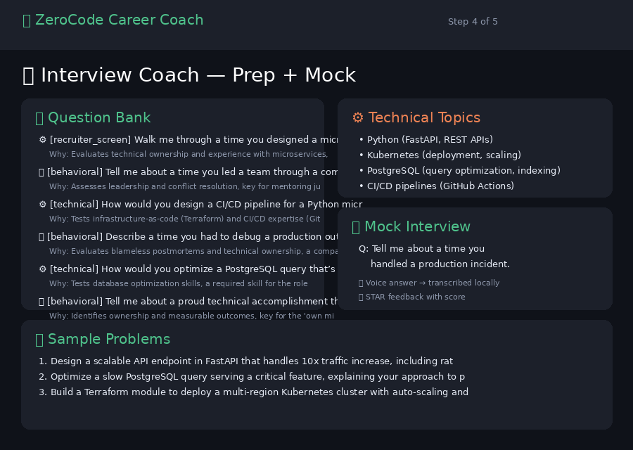
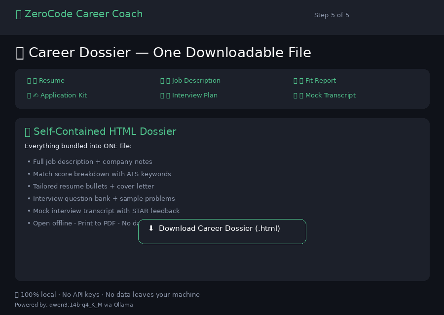

<div align="center">

# 🎯 ZeroCode Career Coach

**A recruiter-designed, fully local AI job-search assistant — no coding required to use it.**
Upload your resume + a job description → get an honest fit score, a tailored resume & cover letter,
voice-driven mock interviews, and a single downloadable dossier — all running **free** on a local
[Ollama](https://ollama.com) model. No API keys. No data leaves your machine.

[](https://www.python.org/)
[](#-tests)
[](LICENSE)

</div>

---

## 🚦 Choose how to use it

This app runs **two ways**. Pick the one that fits:

| ☁️ Try online (cloud demo) | 🏠 Run locally (full experience) |
|:---|:---|
| Click the link → **no install, no setup** | Install **Python + Ollama** → see below |
| Uses DeepSeek API (free) | Uses **your local Ollama** (free, private) |
| ❌ No voice, keyword-only matching | ✅ Voice mock interview, embedding scores |
| **[Try it now →](https://zerocode-career-coach-ccc9w2xqr8kgtmphjtl5uz.streamlit.app/)** | ⬇️ **See Quick Start below** |

> ⚠️ **The cloud demo cannot run Ollama.** Streamlit Cloud servers have no access to Ollama
> on your machine. If you want voice, privacy, and full features, **run locally**.

<div align="center">


<details>
<summary><b>📊 Feature comparison: cloud demo vs local Ollama</b></summary>

| | Local Ollama | Cloud demo |
|--|:--:|:--:|
| Cost | Free | Free tier (DeepSeek API) |
| Privacy | 100% local | Sent to DeepSeek |
| Voice mock interview | ✅ via local Whisper | ❌ (text only) |
| Match score with embeddings | ✅ full | keyword-only |
| Setup time | ~10 min (install Ollama + pull model) | 0 — click and go |
| Requires API key | No | Yes (free, included in deploy) |

</details>

### 📸 Step-by-step screenshots

| Setup | Fit & Strategy | Tailored Application | Interview Coach | Career Dossier |
|:-----:|:-------------:|:--------------------:|:---------------:|:--------------:|
| [](docs/demo_step1.png) | [](docs/demo_step2.png) | [](docs/demo_step3.png) | [](docs/demo_step4.png) | [](docs/demo_step5.png) |

<sub>Click any screenshot to enlarge · All outputs generated by a **real local LLM** (qwen3:14b), not mock data.</sub>

</div>

---

## ✨ What it does

| Step | What happens | What you do | What you get |
|------|-------------|-------------|--------------|
| **1 · Setup** | Upload resume + paste job description | Browse for your resume file (PDF/DOCX/TXT), type/paste the JD, optionally add company notes and your working-style preferences | Parsed resume text, saved job details |
| **2 · Fit & Strategy** | Recruiter agent screens your fit | Click **"Analyze fit"** — the app runs the match score + LLM analysis | Score 0–100, matched/missing keywords, strengths & gaps, action plan |
| **3 · Tailor Application** | Writer agent rewrites resume + cover letter | Click **"Generate tailored resume + cover letter"** | Improved resume bullets (XYZ formula), personable cover letter, LinkedIn suggestions |
| **4 · Interview Coach** | Coach builds prep plan + mock interview | Click **"Build interview prep plan"**, then optionally start a mock interview (answer via text or voice) | Question bank, technical topics, STAR-graded answers with feedback |
| **5 · Career Dossier** | Everything bundled into one HTML file | Click **"Download Career Dossier"** | Self-contained HTML file — open offline, print to PDF |

**Why it's different:** the match score is **deterministic** (keyword coverage + embedding
similarity), not an LLM guess — so it's reproducible and explainable. The LLM only adds judgement
on top.

---

## 🧠 Architecture

A deliberate redesign from a sprawling 7-agent pipeline down to **3 agents + 1 deterministic orchestrator**.

```
            ┌─────────────────────────────────────────────┐
            │   Orchestrator (no LLM): CareerFile state,    │
            │   deterministic match score, dossier export   │
            └───────────────┬─────────────────────────────┘
                            │
   ┌────────────────┬───────┴────────┬───────────────────┐
   ▼                ▼                ▼                    ▼
 Recruiter        Writer            Coach            Streamlit UI
 fit + score   tailored resume   prep + voice mock   (5 guided steps)
 + strategy    + cover letter    + STAR feedback
```

| Agent | Role | Skill modules |
|-------|------|---------------|
| **Recruiter** | Screens fit like a real tech recruiter; score, strengths/gaps, action plan. | `fit-analysis`, `ats-keywords` |
| **Writer** | Tailors resume bullets + writes a personable cover letter; humanizes the voice. | `resume-tailoring`, `cover-letter`, `voice-humanize` |
| **Coach** | Builds prep + runs the voice/text mock interview with STAR feedback. | `interview-behavioral`, `interview-technical` |

**Skills as prompt modules:** `src/skills/*.md` hold distilled expert frameworks (ATS rules,
Google's XYZ formula, STAR, scoring rubrics) adapted from MIT collections like
[Paramchoudhary/ResumeSkills](https://github.com/Paramchoudhary/ResumeSkills). Each agent loads the
relevant modules into its system prompt — **edit a markdown file to change behaviour, no code change needed.**

---

## 🧭 How to use the app

1. **Step 1 — Set up.** Upload your resume (PDF/DOCX/TXT), paste the job description, add optional company notes and your working-style preferences.
2. **Step 2 — Check fit.** Click **"Analyze fit"** — the Recruiter agent scores your match (0–100), lists strengths, gaps, and ATS keywords.
3. **Step 3 — Tailor.** Click **"Generate tailored resume + cover letter"** — the Writer rewrites your bullets and drafts a cover letter.
4. **Step 4 — Practice.** Click **"Build interview prep plan"** for a question bank. Then start a mock interview — answer by **voice** (local) or text, get STAR feedback with a score.
5. **Step 5 — Export.** Click **"Download Career Dossier"** — one HTML file with everything.

---

## ⚡ Quick start

### Option A: Local Ollama (recommended — free, private) 🏠

> Requires **Python 3.11+** and **[Ollama](https://ollama.com/download)**.

```bash
# 1. Pull the models (one-time)
ollama pull qwen3:14b-q4_K_M       # default chat model (or qwen2.5:7b for a lighter ~5GB option)
ollama pull nomic-embed-text

# 2. Install + run
python -m venv .venv && source .venv/bin/activate      # Windows: .\.venv\Scripts\Activate.ps1
pip install -r requirements.txt          # core deps
pip install -r requirements-voice.txt   # voice: mic + Whisper + TTS (local only)
streamlit run app.py                    # → http://localhost:8501
```

### Option B: Free hosted API (no Ollama install) ☁️

> Just Python 3.11+ and a **free API key** (30 seconds to set up).

```bash
# 1. Get a free API key at https://platform.deepseek.com (or https://console.groq.com/keys)
# 2. Copy the env template and paste your key
cp .env.example .env
#    ↑ edit CC_HOSTED_API_KEY=sk-your-key-here

# 3. Install + run
python -m venv .venv && source .venv/bin/activate
pip install -r requirements.txt
streamlit run app.py                    # no Ollama needed!
```

The app auto-loads `.env` and switches to hosted mode when it sees `CC_PROVIDER=hosted`.
Voice features are disabled in this mode (cloud hosts can't run local Whisper).

<details>
<summary><b>Running Ollama inside WSL?</b> (click)</summary>

Run the app from the **same WSL shell** as Ollama — they talk over `localhost:11434` and WSL2
forwards `:8501` to Windows, so you open it in your normal browser:

```bash
cd /path/to/Career-Orchestrator-MultiAgent-Platform
source .venv/bin/activate
streamlit run app.py        # open http://localhost:8501 in Windows
```
Only if you run the app from **Windows** while Ollama stays in WSL do you need
`CC_OLLAMA_HOST=http://$(wsl hostname -I):11434`.</details>

---

## 🎤 Voice

Voice answers are transcribed **locally** with [faster-whisper](https://github.com/SYSTRAN/faster-whisper)
(no key, no cloud); the browser mic is captured by `streamlit-mic-recorder`, and the coach can read
questions aloud via free `edge-tts`. Defaults to **CPU** (portable); set `CC_WHISPER_DEVICE=cuda`
for GPU, with automatic CPU fallback. Missing voice packages? The app silently falls back to text.

---

## 🌐 Deploy a free public demo

Free hosts can't run Ollama, so point the app at a free **hosted** model instead:

1. Push this repo to GitHub.
2. Create an app on **[share.streamlit.io](https://share.streamlit.io)** → `app.py`.
3. In **Settings → Secrets**, paste [`.streamlit/secrets.toml.example`](.streamlit/secrets.toml.example)
   and add your [DeepSeek](https://platform.deepseek.com) API key (`sk-…`).
   This sets `CC_PROVIDER=hosted` and disables voice.
4. Copy the resulting URL into the **[Try online](#-choose-how-to-use-it)** section above.

---

## ⚙️ Configuration

All settings come from `CC_*` environment variables (or Streamlit secrets):

| Var | Default | Purpose |
|-----|---------|---------|
| `CC_PROVIDER` | `ollama` | `ollama` (local) or `hosted` (cloud demo) |
| `CC_CHAT_MODEL` | `qwen3:14b-q4_K_M` | local chat model |
| `CC_EMBED_MODEL` | `nomic-embed-text` | local embedding model |
| `CC_OLLAMA_HOST` | `http://localhost:11434` | Ollama endpoint |
| `CC_HOSTED_BASE_URL` | DeepSeek URL | OpenAI-compatible endpoint for hosted mode |
| `CC_HOSTED_API_KEY` | _(empty)_ | DeepSeek (or Groq/OpenRouter) key for hosted mode |
| `CC_HOSTED_CHAT_MODEL` | `deepseek-chat` | model to use in hosted mode |
| `CC_WHISPER_MODEL` | `base` | Whisper size (`tiny`…`large-v3`) |
| `CC_WHISPER_DEVICE` | `cpu` | `cuda` for GPU (auto-falls back to CPU) |
| `CC_ENABLE_VOICE` | `1` | `0` to hide voice features |

---

## 🧪 Tests

The suite mocks the LLM, so **no Ollama is needed** to run it:

```bash
pip install -r requirements.txt
pytest
```

Covers deterministic scoring, parsers, each agent's JSON contract, and the dossier builder.
Two live dev scripts also exist: `scripts/dev_e2e.py` (agent pipeline) and
`scripts/dev_voice_test.py` (TTS→Whisper→feedback round-trip).

---

## 📁 Project layout

```
app.py                      Streamlit entry (5-step nav)
src/
  config.py                 env-driven settings
  llm/client.py             chat + embeddings (Ollama / hosted)
  agents/                   base + recruiter + writer + coach
  skills/                   the prompt-module markdown
  orchestrator/             scoring · session (CareerFile) · dossier
  parsers/                  resume (pdf/docx/txt) · jd
  voice/                    stt (faster-whisper) · tts (edge-tts)
  ui/steps.py               the 5 step views
templates/dossier.html.j2   single-file HTML dossier
scripts/                    smoke_check · dev_e2e · dev_voice_test
tests/                      pytest suite (LLM mocked)
```

---

## 📜 License

MIT — see [`LICENSE`](LICENSE). Skill frameworks adapted from MIT-licensed collections, notably
[Paramchoudhary/ResumeSkills](https://github.com/Paramchoudhary/ResumeSkills) and
[ComposioHQ/awesome-claude-skills](https://github.com/ComposioHQ/awesome-claude-skills).
