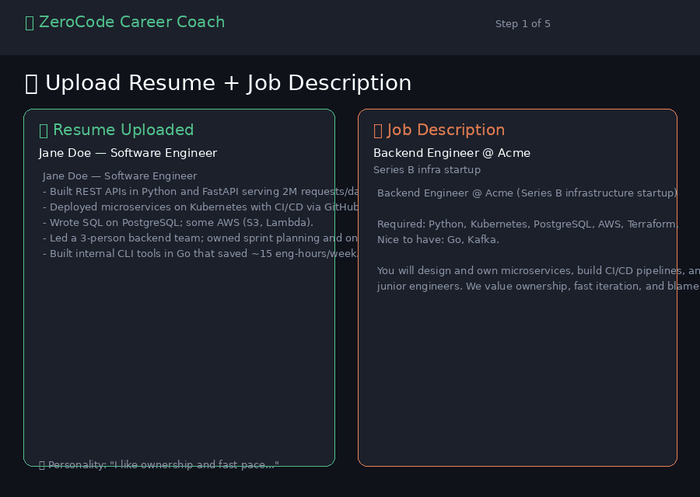

<div align="center">

# 🎯 ZeroCode Career Coach

**A recruiter-designed, fully local AI job-search assistant — no coding required to use it.**
Upload your resume + a job description → get an honest fit score, a tailored resume & cover letter,
voice-driven mock interviews, and a single downloadable dossier — all running **free** on a local
[Ollama](https://ollama.com) model. No API keys. No data leaves your machine.

[](https://www.python.org/)
[](https://streamlit.io/)
[](https://ollama.com/)
[](#-tests)
[](LICENSE)

</div>

---

## 🚀 Live Demo

> **▶️ Try it here:** **[`<ADD-YOUR-DEMO-URL>`](#)** &nbsp;_(deploy in a few clicks — see [below](#-deploy-a-free-public-demo))_
>
> ⚠️ Free public hosts (Streamlit Community Cloud, Hugging Face Spaces) **cannot run Ollama**, so
> the hosted demo uses a free hosted model (Groq) and disables voice. **Run locally for the full,
> private experience with voice.**

<!-- Replace the placeholder above with your real URL once deployed.
     To add a demo GIF: drop docs/demo.gif into the repo and uncomment:
      -->

<div align="center">
<!-- Screenshots — replace with your own captures -->
<i>📸 Add screenshots to <code>docs/</code> and embed them here (Fit score · Tailored cover letter · Voice mock interview · Dossier).</i>
</div>

---

## ✨ What it does

| Step | You get |
|------|---------|
| **1 · Setup** | Upload resume (PDF/DOCX/TXT), paste the JD, add company notes + a few personal notes. |
| **2 · Fit & Strategy** | An **explainable match score** (0–100), matched vs. missing ATS keywords, honest strengths & gaps, culture-fit reflection questions, and a prioritized *"what to do next"* plan. |
| **3 · Tailor Application** | Resume bullets rewritten with the **XYZ formula** (ATS keywords + quantified + *your* voice) and a personable, non-robotic cover letter. |
| **4 · Interview Coach** | A tailored question bank + an **interactive mock interview you answer by voice** (local Whisper), with STAR feedback and follow-ups. |
| **5 · Career Dossier** | Everything bundled into **one self-contained HTML file** — open offline, print to PDF. |

**Why it's different:** the match score is **deterministic** (keyword coverage + embedding
similarity), not an LLM guess — so it's reproducible and explainable. The LLM only adds judgement
on top.

---

## 🧠 Architecture

A deliberate redesign from a sprawling 7-agent pipeline down to **3 agents + 1 deterministic orchestrator**.

```
            ┌─────────────────────────────────────────────┐
            │   Orchestrator (no LLM): CareerFile state,    │
            │   deterministic match score, dossier export   │
            └───────────────┬─────────────────────────────┘
                            │
   ┌────────────────┬───────┴────────┬───────────────────┐
   ▼                ▼                ▼                    ▼
 Recruiter        Writer            Coach            Streamlit UI
 fit + score   tailored resume   prep + voice mock   (5 guided steps)
 + strategy    + cover letter    + STAR feedback
```

| Agent | Role | Skill modules |
|-------|------|---------------|
| **Recruiter** | Screens fit like a real tech recruiter; score, strengths/gaps, action plan. | `fit-analysis`, `ats-keywords` |
| **Writer** | Tailors resume bullets + writes a personable cover letter; humanizes the voice. | `resume-tailoring`, `cover-letter`, `voice-humanize` |
| **Coach** | Builds prep + runs the voice/text mock interview with STAR feedback. | `interview-behavioral`, `interview-technical` |

**Skills as prompt modules:** `src/skills/*.md` hold distilled expert frameworks (ATS rules,
Google's XYZ formula, STAR, scoring rubrics) adapted from MIT collections like
[Paramchoudhary/ResumeSkills](https://github.com/Paramchoudhary/ResumeSkills). Each agent loads the
relevant modules into its system prompt — **edit a markdown file to change behaviour, no code change needed.**

---

## ⚡ Quick start (local — recommended)

> Requires **Python 3.11+** and **[Ollama](https://ollama.com/download)**.

```bash
# 1. Pull the models (one-time)
ollama pull qwen3:14b-q4_K_M       # default chat model (or qwen2.5:7b for a lighter ~5GB option)
ollama pull nomic-embed-text

# 2. Install + run
python -m venv .venv && source .venv/bin/activate      # Windows: .\.venv\Scripts\Activate.ps1
pip install -r requirements.txt          # core deps
pip install -r requirements-voice.txt   # voice: mic + Whisper + TTS (local only)
streamlit run app.py                    # → http://localhost:8501
```

<details>
<summary><b>Running Ollama inside WSL?</b> (click)</summary>

Run the app from the **same WSL shell** as Ollama — they talk over `localhost:11434` and WSL2
forwards `:8501` to Windows, so you open it in your normal browser:

```bash
cd /path/to/Career-Orchestrator-MultiAgent-Platform
source .venv/bin/activate
streamlit run app.py        # open http://localhost:8501 in Windows
```
Only if you run the app from **Windows** while Ollama stays in WSL do you need
`CC_OLLAMA_HOST=http://$(wsl hostname -I):11434`.
</details>

---

## 🎤 Voice

Voice answers are transcribed **locally** with [faster-whisper](https://github.com/SYSTRAN/faster-whisper)
(no key, no cloud); the browser mic is captured by `streamlit-mic-recorder`, and the coach can read
questions aloud via free `edge-tts`. Defaults to **CPU** (portable); set `CC_WHISPER_DEVICE=cuda`
for GPU, with automatic CPU fallback. Missing voice packages? The app silently falls back to text.

---

## 🌐 Deploy a free public demo

Free hosts can't run Ollama, so point the app at a free **hosted** model instead:

1. Push this repo to GitHub.
2. Create an app on **[share.streamlit.io](https://share.streamlit.io)** → `app.py`.
3. In **Settings → Secrets**, paste [`.streamlit/secrets.toml.example`](.streamlit/secrets.toml.example)
   and add your [DeepSeek](https://platform.deepseek.com) API key (`sk-…`).
   This sets `CC_PROVIDER=hosted` and disables voice.
4. Copy the resulting URL into the **[Live Demo](#-live-demo)** section above.

| | Local (Ollama) | Public demo (hosted) |
|--|:--:|:--:|
| Cost | Free | Free tier |
| Privacy | 100% local | Sent to provider |
| Voice mock | ✅ | ❌ (text only) |
| Match embeddings | ✅ | keyword-only |

---

## ⚙️ Configuration

All settings come from `CC_*` environment variables (or Streamlit secrets):

| Var | Default | Purpose |
|-----|---------|---------|
| `CC_PROVIDER` | `ollama` | `ollama` (local) or `hosted` (cloud demo) |
| `CC_CHAT_MODEL` | `qwen3:14b-q4_K_M` | local chat model |
| `CC_EMBED_MODEL` | `nomic-embed-text` | local embedding model |
| `CC_OLLAMA_HOST` | `http://localhost:11434` | Ollama endpoint |
| `CC_HOSTED_BASE_URL` | DeepSeek URL | OpenAI-compatible endpoint for hosted mode |
| `CC_HOSTED_API_KEY` | _(empty)_ | DeepSeek (or Groq/OpenRouter) key for hosted mode |
| `CC_HOSTED_CHAT_MODEL` | `deepseek-chat` | model to use in hosted mode |
| `CC_WHISPER_MODEL` | `base` | Whisper size (`tiny`…`large-v3`) |
| `CC_WHISPER_DEVICE` | `cpu` | `cuda` for GPU (auto-falls back to CPU) |
| `CC_ENABLE_VOICE` | `1` | `0` to hide voice features |

---

## 🧪 Tests

The suite mocks the LLM, so **no Ollama is needed** to run it:

```bash
pip install -r requirements.txt
pytest
```

Covers deterministic scoring, parsers, each agent's JSON contract, and the dossier builder.
Two live dev scripts also exist: `scripts/dev_e2e.py` (agent pipeline) and
`scripts/dev_voice_test.py` (TTS→Whisper→feedback round-trip).

---

## 📁 Project layout

```
app.py                      Streamlit entry (5-step nav)
src/
  config.py                 env-driven settings
  llm/client.py             chat + embeddings (Ollama / hosted)
  agents/                   base + recruiter + writer + coach
  skills/                   the prompt-module markdown
  orchestrator/             scoring · session (CareerFile) · dossier
  parsers/                  resume (pdf/docx/txt) · jd
  voice/                    stt (faster-whisper) · tts (edge-tts)
  ui/steps.py               the 5 step views
templates/dossier.html.j2   single-file HTML dossier
scripts/                    smoke_check · dev_e2e · dev_voice_test
tests/                      pytest suite (LLM mocked)
```

---

## 📜 License

MIT — see [`LICENSE`](LICENSE). Skill frameworks adapted from MIT-licensed collections, notably
[Paramchoudhary/ResumeSkills](https://github.com/Paramchoudhary/ResumeSkills) and
[ComposioHQ/awesome-claude-skills](https://github.com/ComposioHQ/awesome-claude-skills).
